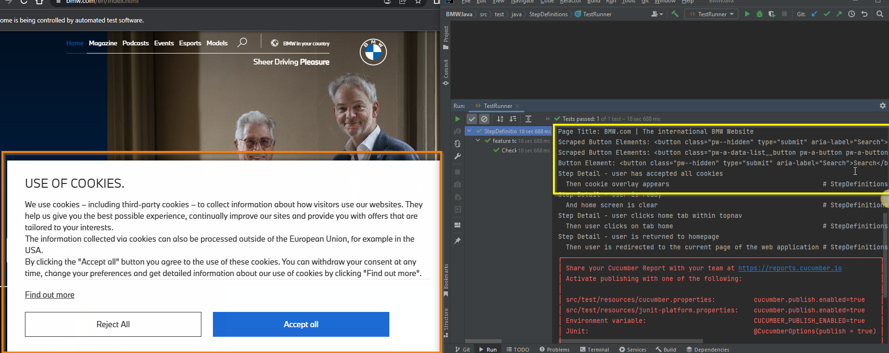

# bmw-java-selenium

My goal is recap java fundamentals by building a test framework for BMW.com  My reasoning for using the BMW.com site for this java-selenium POC is to not only apply the last 4 years of  automation experience in a fresh implementation but to also explore the more modern approaches to java based ui automation with the recent rise in scripting-type languages taking a preference for ui test automation.  BMW has invested their resources in a beautifully built PWA(Progressive Web Application) to represent the automotive  brand on the internet globally. Their technology team made the investment to maximize the performance of a web based application caching data to the physical device to improve  response times for requests made across it.  Since 2019 it remains a shining example of how websites and web applications should evolve for the years to come as the internet and its use expands rapidly.  [Read more about BMW.com here!](https://www.thinkwithgoogle.com/intl/en-gb/marketing-strategies/app-and-mobile/bmws-journey-fast-smooth-and-reliable-mobile-website/)    -- Carl E Jones III  For educational use only!
